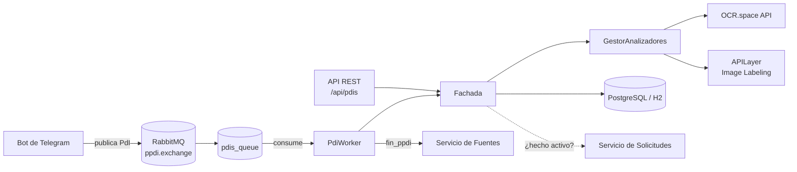

# MetaMapa — Procesador de Piezas de Información (PPDI)

Microservicio desarrollado en **Java 17 + Spring Boot** como parte de **MetaMapa**, el trabajo práctico anual de *Diseño de Sistemas de Información* (UTN FRBA, 2025).

MetaMapa es un sistema distribuido en microservicios para registrar y consultar **hechos** georreferenciados. Este servicio se encarga de procesar las **piezas de información (PdI)** asociadas a cada hecho: recibe la pieza, analiza su imagen consumiendo **APIs externas de OCR y etiquetado**, guarda los resultados y le avisa al servicio de **Fuentes** cuando terminó.

El procesamiento es **asincrónico**: las piezas llegan por una **cola de trabajo en RabbitMQ** y un worker las consume a su ritmo, sin bloquear a quien las envía. El sistema también incluye un **bot de Telegram**, desarrollado por el equipo, que consume este servicio.

🔗 **Deploy:** https://ppdi.onrender.com/

---

## Arquitectura



**Flujo de una pieza de información:**

1. La PdI se publica en el exchange `ppdi.exchange` (tipo *fanout*) y queda en la cola durable `pdis_queue`.
2. El `PdiWorker` la consume con `@RabbitListener`. El worker se activa y desactiva en caliente desde la API, sin reiniciar el servicio.
3. El `GestorAnalizadores` recorre todos los analizadores registrados: **OCR** extrae el texto de la imagen y el **Etiquetador** detecta qué objetos aparecen en ella.
4. Los resultados se persisten junto con la pieza, vía JPA.
5. El worker notifica al servicio de **Fuentes** (`POST /hechos/{id}/fin_ppdi`). Si algo falla, el mensaje se rechaza y Spring AMQP maneja el NACK.

Agregar un analizador nuevo solo requiere implementar la interfaz `Analizador`: Spring lo inyecta automáticamente en el gestor (patrón *Strategy*).

---

## Mi aporte

- Integración con **APIs externas** (OCR.space y APILayer Image Labeling) mediante clientes HTTP, con manejo de errores y respuestas vacías.
- Implementación de la **cola de trabajo con RabbitMQ** para el procesamiento asincrónico: configuración del exchange, la cola y el binding, el worker consumidor y su activación y desactivación por API.
- Comunicación con los demás microservicios de MetaMapa (Fuentes y Solicitudes).
- Integración del servicio con el **bot de Telegram** del sistema.

---

## Tecnologías

| Área | Herramientas |
|---|---|
| Lenguaje y framework | Java 17, Spring Boot 3 (Web, Data JPA, AMQP) |
| Mensajería | RabbitMQ (CloudAMQP) |
| Persistencia | PostgreSQL, H2 (desarrollo), Hibernate |
| APIs externas | OCR.space, APILayer Image Labeling |
| Observabilidad | Micrometer + Datadog |
| Calidad | JUnit, Mockito |
| Deploy | Docker, Render |

---

## API

### Piezas de información — `/api/pdis`

| Método | Endpoint | Descripción |
|---|---|---|
| `GET` | `/api/pdis` | Lista las piezas procesadas |
| `GET` | `/api/pdis/{id}` | Obtiene una pieza por id |
| `POST` | `/api/pdis` | Procesa una pieza de forma sincrónica |
| `DELETE` | `/api/pdis` | Elimina todas las piezas |
| `GET` | `/api/pdis/{id}/resultado_analisis` | Resultados de todos los analizadores |
| `GET` | `/api/pdis/{id}/resultado_analisis/{analizador}` | Resultado de un analizador (`OCR`, `ETIQUETADOR`) |

### Worker — `/api/worker`

| Método | Endpoint | Descripción |
|---|---|---|
| `POST` | `/api/worker/activar` | Empieza a consumir mensajes de la cola |
| `POST` | `/api/worker/desactivar` | Deja de consumir mensajes |
| `GET` | `/api/worker/estado` | Indica si el worker está activo |
| `GET` | `/api/worker/health` | Health check del worker |

---

## Cómo correrlo

### Variables de entorno

| Variable | Descripción |
|---|---|
| `DB_URL`, `DB_USERNAME`, `DB_PASSWORD` | Conexión a PostgreSQL (perfil `postgres`) |
| `SPRING_RABBITMQ_HOST`, `SPRING_RABBITMQ_USERNAME`, `SPRING_RABBITMQ_PASSWORD`, `SPRING_RABBITMQ_VIRTUAL_HOST` | Conexión a RabbitMQ |
| `EXCHANGE`, `QUEUE` | Nombres del exchange y la cola (por defecto `ppdi.exchange` y `pdis_queue`) |
| `OCR_API_KEY` | API key de OCR.space |
| `ETIQUETADOR_API_KEY` | API key de APILayer |
| `FUENTE_URL` | URL del servicio de Fuentes |
| `SOLICITUDES_SERVICE_URL` | URL del servicio de Solicitudes |
| `DD_API_KEY`, `DD_APP_KEY` | Credenciales de Datadog (opcional) |
| `DD_METRICS_ENABLED` | `true` para exportar métricas a Datadog (por defecto `false`) |

### Local (base H2 en memoria)

```bash
./mvnw spring-boot:run
```

### Con PostgreSQL

```bash
./mvnw spring-boot:run -Dspring-boot.run.profiles=postgres
```

### Con Docker

```bash
docker build -t ppdi .
docker run -p 8080:8080 --env-file .env ppdi
```

---

Trabajo práctico grupal de la materia *Diseño de Sistemas de Información* — UTN FRBA, 2025.

- **Fernando Aquino** — [GitHub](https://github.com/Fernando-23) · [LinkedIn](https://www.linkedin.com/in/fernando-aquino-jesus)
